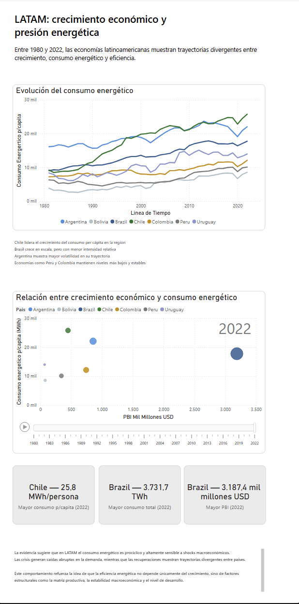

# 📊 LATAM Energy Dashboard – Growth & Energy Pressure

## 🧭 Overview
This project analyzes the relationship between economic growth and energy consumption across Latin American countries between 1980 and 2022.

The dashboard explores how energy demand evolves alongside economic expansion, highlighting differences in scale, efficiency, and structural dynamics across the region.

---

## 🎯 Objective
To evaluate how economic growth impacts energy consumption patterns in LATAM, identifying differences in energy intensity, development paths, and structural efficiency between countries.

---

## 📊 Key Insights

- **Brazil dominates in scale**, leading both in total GDP and total energy consumption.
- **Chile shows the highest energy consumption per capita**, suggesting higher energy intensity relative to its economic size.
- **Argentina presents moderate levels with higher volatility**, indicating sensitivity to macroeconomic cycles.
- **Peru and Colombia exhibit lower and more stable consumption patterns**, consistent with different development structures.
- The region shows **heterogeneous trajectories**, reflecting differences in industrial composition, economic stability, and energy efficiency.

---

## 📈 Dashboard Structure

### 1. Energy Consumption Over Time
- Line chart showing energy consumption per capita evolution.
- Highlights long-term trends and divergence across countries.

### 2. GDP vs Energy Consumption
- Scatter plot illustrating the relationship between economic size and energy use.
- Animated over time to show structural evolution.

### 3. KPI Snapshot (2022)
- Highest energy consumption per capita → Chile  
- Highest total energy consumption → Brazil  
- Highest GDP → Brazil  

---

## 🧠 Analytical Approach

- Data filtered for selected LATAM countries
- Time range adjusted to **1980–2022** to ensure data consistency
- Focus on **per capita vs total metrics** to avoid misleading comparisons
- Use of DAX measures to manage aggregation and context
- Validation of data quality and removal of unreliable variables (e.g., emissions due to missing data)

> Each observation represents a **country-year combination**, ensuring consistent granularity for analysis. :contentReference[oaicite:0]{index=0}

---

## 🛠 Tools & Technologies

- Power BI (data modeling & visualization)
- DAX (measures and context control)
- Excel (initial data exploration)
- Dataset: Our World in Data – Energy Dataset  
  https://github.com/owid/energy-data

---

## ⚠️ Data Considerations

- Missing values in GDP and energy efficiency metrics for recent years (2023–2024)
- Adjustments made to avoid distortions in KPIs
- Units standardized across all visuals (MWh per capita, TWh total, USD billions)

---

## 📌 Conclusion

Energy consumption in LATAM is strongly linked to economic activity but follows **non-uniform patterns** across countries.

The analysis suggests that:
- Growth alone does not determine energy demand
- Structural factors (industry mix, efficiency, stability) play a key role
- The region exhibits **divergent development paths in energy usage**

---

## 📷 Dashboard Preview

---

## 📁 Files

- `LATAM-dashboard.pbix` → Full interactive dashboard
- `/images` → Dashboard screenshots
- `/docs` → Technical notes and data preparation (optional)

---

## 👤 Author

Laura Agostina Spena  
Data Analyst (Power BI | SQL | Data Storytelling)
